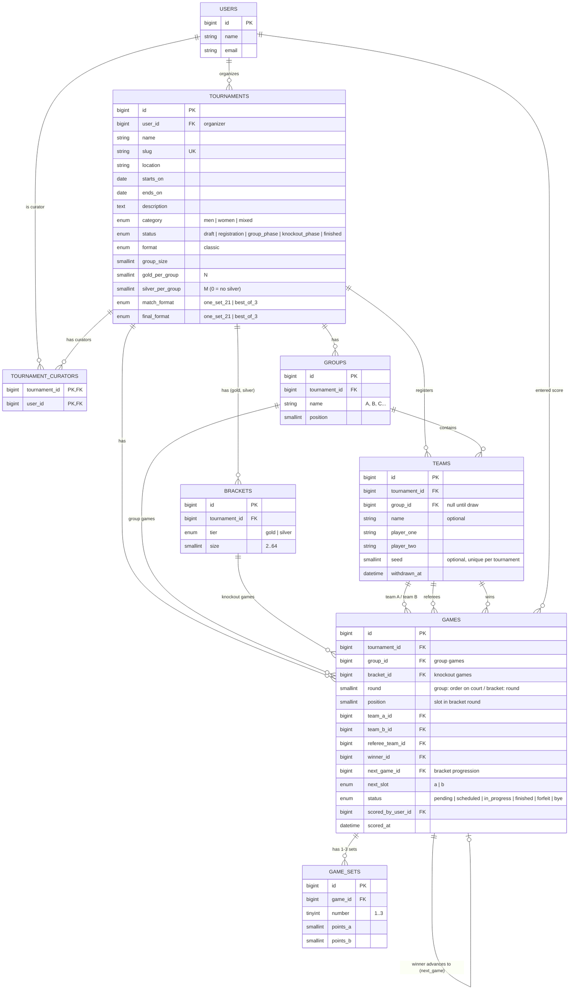

```mermaid
erDiagram
    USERS ||--o{ TOURNAMENTS : "organizes"
    USERS ||--o{ TOURNAMENT_CURATORS : "is curator"
    TOURNAMENTS ||--o{ TOURNAMENT_CURATORS : "has curators"
    TOURNAMENTS ||--o{ TEAMS : "registers"
    TOURNAMENTS ||--o{ GROUPS : "has"
    TOURNAMENTS ||--o{ BRACKETS : "has (gold, silver)"
    TOURNAMENTS ||--o{ GAMES : "has"
    GROUPS ||--o{ TEAMS : "contains"
    GROUPS ||--o{ GAMES : "group games"
    BRACKETS ||--o{ GAMES : "knockout games"
    TEAMS ||--o{ GAMES : "team A / team B"
    TEAMS ||--o{ GAMES : "referees"
    TEAMS ||--o{ GAMES : "wins"
    GAMES ||--o| GAMES : "winner advances to (next_game)"
    GAMES ||--o{ GAME_SETS : "has 1-3 sets"
    USERS ||--o{ GAMES : "entered score"

    USERS {
        bigint id PK
        string name
        string email
    }
    TOURNAMENTS {
        bigint id PK
        bigint user_id FK "organizer"
        string name
        string slug UK
        string location
        date starts_on
        date ends_on
        text description
        enum category "men | women | mixed"
        enum status "draft | registration | group_phase | knockout_phase | finished"
        enum format "classic"
        smallint group_size
        smallint gold_per_group "N"
        smallint silver_per_group "M (0 = no silver)"
        enum match_format "one_set_21 | best_of_3"
        enum final_format "one_set_21 | best_of_3"
    }
    TOURNAMENT_CURATORS {
        bigint tournament_id PK,FK
        bigint user_id PK,FK
    }
    TEAMS {
        bigint id PK
        bigint tournament_id FK
        bigint group_id FK "null until draw"
        string name "optional"
        string player_one
        string player_two
        smallint seed "optional, unique per tournament"
        datetime withdrawn_at
    }
    GROUPS {
        bigint id PK
        bigint tournament_id FK
        string name "A, B, C..."
        smallint position
    }
    BRACKETS {
        bigint id PK
        bigint tournament_id FK
        enum tier "gold | silver"
        smallint size "2..64"
    }
    GAMES {
        bigint id PK
        bigint tournament_id FK
        bigint group_id FK "group games"
        bigint bracket_id FK "knockout games"
        smallint round "group: order on court / bracket: round"
        smallint position "slot in bracket round"
        bigint team_a_id FK
        bigint team_b_id FK
        bigint referee_team_id FK
        bigint winner_id FK
        bigint next_game_id FK "bracket progression"
        enum next_slot "a | b"
        enum status "pending | scheduled | in_progress | finished | forfeit | bye"
        bigint scored_by_user_id FK
        datetime scored_at
    }
    GAME_SETS {
        bigint id PK
        bigint game_id FK
        tinyint number "1..3"
        smallint points_a
        smallint points_b
    }
```