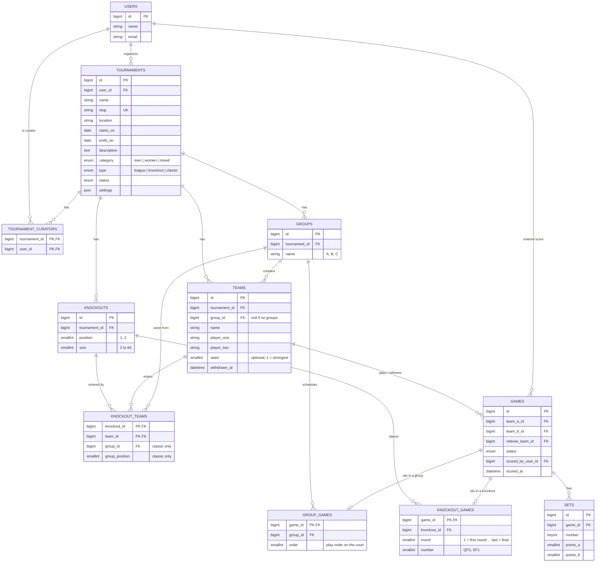

```mermaid
erDiagram
    USERS ||--o{ TOURNAMENTS : organizes
    USERS ||--o{ TOURNAMENT_CURATORS : "is curator"
    TOURNAMENTS ||--o{ TOURNAMENT_CURATORS : has
    TOURNAMENTS ||--o{ TEAMS : has
    TOURNAMENTS ||--o{ GROUPS : has
    TOURNAMENTS ||--o{ KNOCKOUTS : has

    GROUPS ||--o{ TEAMS : contains
    GROUPS ||--o{ GROUP_GAMES : schedules
    KNOCKOUTS ||--o{ KNOCKOUT_GAMES : places
    KNOCKOUTS ||--o{ KNOCKOUT_TEAMS : "entered by"
    TEAMS ||--o{ KNOCKOUT_TEAMS : enters
    GROUPS ||--o{ KNOCKOUT_TEAMS : "came from"

    GAMES ||--o| GROUP_GAMES : "sits in a group"
    GAMES ||--o| KNOCKOUT_GAMES : "sits in a knockout"
    TEAMS ||--o{ GAMES : "plays / referees"
    USERS ||--o{ GAMES : "entered score"
    GAMES ||--o{ SETS : has

    USERS {
        bigint id PK
        string name
        string email
    }
    TOURNAMENTS {
        bigint id PK
        bigint user_id FK
        string name
        string slug UK
        string location
        date starts_on
        date ends_on
        text description
        enum category "men | women | mixed"
        enum type "league | knockout | classic"
        enum status
        json settings
    }
    TOURNAMENT_CURATORS {
        bigint tournament_id PK, FK
        bigint user_id PK, FK
    }
    TEAMS {
        bigint id PK
        bigint tournament_id FK
        bigint group_id FK "null if no groups"
        string name
        string player_one
        string player_two
        smallint seed "optional, 1 = strongest"
        datetime withdrawn_at
    }
    GROUPS {
        bigint id PK
        bigint tournament_id FK
        string name "A, B, C"
    }
    KNOCKOUTS {
        bigint id PK
        bigint tournament_id FK
        smallint position "1, 2"
        smallint size "2 to 64"
    }
    KNOCKOUT_TEAMS {
        bigint knockout_id PK, FK
        bigint team_id PK, FK
        bigint group_id FK "classic only"
        smallint group_position "classic only"
    }
    GAMES {
        bigint id PK
        bigint team_a_id FK
        bigint team_b_id FK
        bigint referee_team_id FK
        enum status
        bigint scored_by_user_id FK
        datetime scored_at
    }
    GROUP_GAMES {
        bigint game_id PK, FK
        bigint group_id FK
        smallint order "play order on the court"
    }
    KNOCKOUT_GAMES {
        bigint game_id PK, FK
        bigint knockout_id FK
        smallint round "1 = first round ... last = final"
        smallint number "QF3, SF1"
    }
    SETS {
        bigint id PK
        bigint game_id FK
        tinyint number
        smallint points_a
        smallint points_b
    }
```